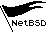

# mlcd

Command line utility and Lua module for drawing graphics to a Dreamcast Visual Memory Unit's LCD (Maple LCD).

## Usage

To draw to the first VMU LCD connected to the system:
```
$ mlcd -d img.bmp > /dev/mlcd0.0
```

See [test/example.lua](test/example.lua) for using the lua module.

```lua
-- Draw a point moving through the center of the display
local mlcd = require 'mlcd'
local x = 0
mlcd.draw("/dev/mlcd0.0", function ()
        mlcd.clear()
        mlcd.point(x, mlcd.HEIGHT / 2)
        x = x + 1
        if x == mlcd.WIDTH then
                x = 0
        end
end)
```

To run from the command line:
```
$ lua example.lua
```

## Examples




### ASCII binary 
Prints a "1" or "0" for each pixel, useful for previewing.

```
$ mlcd -b mlcd.bmp
000000000000000000000000000000000000000000000000
000000000000000000000000000000000111111111000000
000000000000000000000000000001111111111111111100
000000000000000000000000001111111111000000000000
000000000000000000000001111111111000000000000000
001100000000000000011111111111000000000000000000
101111100000000111111111111110000011111110000000
100111111111111111111111111111111111111111100000
010111111111111111111111111111111110000000000000
010011111111111111111111111111110000000000000000
001011111111111111111111111111000000000000000000
001001111111111111111111111100000000000000000000
000101111111111111111111110000000000000000000000
000100111111111111111111000000000000000000000000
000010011111111111111100000000000000000000000000
000010011111111111000000000000000000000000000000
000001001111111000000000000000000000000000000000
000001000000000000000000000000000000000000000000
000000100000000000000000000000000000000000000000
000000100000000000000000000000000000000000000000
000000010000100010000000010001111000111001110000
000000010000110010011100111001000101000001001000
000000001000111010100010010001111000111001000100
000000001000101110111110010001000100000101000100
000000000100100110100000010001000101000101000100
000000000100100010011100001101111000111001111000
000000000010000000000000000000000000000000000000
000000000010000000000000000000000000000000000000
000000000001000000000000000000000000000000000000
000000000001000000000000000000000000000000000000
000000000000100000000000000000000000000000000000
000000000000100000000000000000000000000000000000
```

### C code
Can be used to replace the default boot image in the [mlcd](https://nxr.netbsd.org/xref/src/sys/arch/dreamcast/dev/maple/mlcd.c#190) NetBSD driver.

```
$ mlcd -c mlcd.bmp
static const char initimg48x32[192] = {
0x00, 0x00, 0x00, 0x00, 0x00, 0x00,
0x00, 0x00, 0x00, 0x00, 0x7f, 0xc0,
0x00, 0x00, 0x00, 0x07, 0xff, 0xfc,
0x00, 0x00, 0x00, 0x3f, 0xf0, 0x00,
0x00, 0x00, 0x01, 0xff, 0x80, 0x00,
0x30, 0x00, 0x1f, 0xfc, 0x00, 0x00,
0xbe, 0x01, 0xff, 0xf8, 0x3f, 0x80,
0x9f, 0xff, 0xff, 0xff, 0xff, 0xe0,
0x5f, 0xff, 0xff, 0xff, 0xe0, 0x00,
0x4f, 0xff, 0xff, 0xff, 0x00, 0x00,
0x2f, 0xff, 0xff, 0xfc, 0x00, 0x00,
0x27, 0xff, 0xff, 0xf0, 0x00, 0x00,
0x17, 0xff, 0xff, 0xc0, 0x00, 0x00,
0x13, 0xff, 0xff, 0x00, 0x00, 0x00,
0x09, 0xff, 0xfc, 0x00, 0x00, 0x00,
0x09, 0xff, 0xc0, 0x00, 0x00, 0x00,
0x04, 0xfe, 0x00, 0x00, 0x00, 0x00,
0x04, 0x00, 0x00, 0x00, 0x00, 0x00,
0x02, 0x00, 0x00, 0x00, 0x00, 0x00,
0x02, 0x00, 0x00, 0x00, 0x00, 0x00,
0x01, 0x08, 0x80, 0x47, 0x8e, 0x70,
0x01, 0x0c, 0x9c, 0xe4, 0x50, 0x48,
0x00, 0x8e, 0xa2, 0x47, 0x8e, 0x44,
0x00, 0x8b, 0xbe, 0x44, 0x41, 0x44,
0x00, 0x49, 0xa0, 0x44, 0x51, 0x44,
0x00, 0x48, 0x9c, 0x37, 0x8e, 0x78,
0x00, 0x20, 0x00, 0x00, 0x00, 0x00,
0x00, 0x20, 0x00, 0x00, 0x00, 0x00,
0x00, 0x10, 0x00, 0x00, 0x00, 0x00,
0x00, 0x10, 0x00, 0x00, 0x00, 0x00,
0x00, 0x08, 0x00, 0x00, 0x00, 0x00,
0x00, 0x08, 0x00, 0x00, 0x00, 0x00
};
```

### aslc86k
Print [aslc86k](http://mc.pp.se/dc/sw.html) code that can be used in VMU games.

```
$ mlcd -a mlcd.bmp
.byte %00000000,%00000000,%00000000,%00000000,%00000000,%00000000
.byte %00000000,%00000000,%00000000,%00000000,%01111111,%11000000
.byte %00000000,%00000000,%00000000,%00000111,%11111111,%11111100
.byte %00000000,%00000000,%00000000,%00111111,%11110000,%00000000
.byte %00000000,%00000000,%00000001,%11111111,%10000000,%00000000
.byte %00110000,%00000000,%00011111,%11111100,%00000000,%00000000
.byte %10111110,%00000001,%11111111,%11111000,%00111111,%10000000
.byte %10011111,%11111111,%11111111,%11111111,%11111111,%11100000
.byte %01011111,%11111111,%11111111,%11111111,%11100000,%00000000
.byte %01001111,%11111111,%11111111,%11111111,%00000000,%00000000
.byte %00101111,%11111111,%11111111,%11111100,%00000000,%00000000
.byte %00100111,%11111111,%11111111,%11110000,%00000000,%00000000
.byte %00010111,%11111111,%11111111,%11000000,%00000000,%00000000
.byte %00010011,%11111111,%11111111,%00000000,%00000000,%00000000
.byte %00001001,%11111111,%11111100,%00000000,%00000000,%00000000
.byte %00001001,%11111111,%11000000,%00000000,%00000000,%00000000
.byte %00000100,%11111110,%00000000,%00000000,%00000000,%00000000
.byte %00000100,%00000000,%00000000,%00000000,%00000000,%00000000
.byte %00000010,%00000000,%00000000,%00000000,%00000000,%00000000
.byte %00000010,%00000000,%00000000,%00000000,%00000000,%00000000
.byte %00000001,%00001000,%10000000,%01000111,%10001110,%01110000
.byte %00000001,%00001100,%10011100,%11100100,%01010000,%01001000
.byte %00000000,%10001110,%10100010,%01000111,%10001110,%01000100
.byte %00000000,%10001011,%10111110,%01000100,%01000001,%01000100
.byte %00000000,%01001001,%10100000,%01000100,%01010001,%01000100
.byte %00000000,%01001000,%10011100,%00110111,%10001110,%01111000
.byte %00000000,%00100000,%00000000,%00000000,%00000000,%00000000
.byte %00000000,%00100000,%00000000,%00000000,%00000000,%00000000
.byte %00000000,%00010000,%00000000,%00000000,%00000000,%00000000
.byte %00000000,%00010000,%00000000,%00000000,%00000000,%00000000
.byte %00000000,%00001000,%00000000,%00000000,%00000000,%00000000
.byte %00000000,%00001000,%00000000,%00000000,%00000000,%00000000
```

### Tips and Tricks

#### Clear screen
```
$ dd if=/dev/zero of=/dev/mlcd0.0 count=192
```

#### Draw random pixels
```
$ dd if=/dev/urandom of=/dev/mlcd0.0 count=192
```

#### Cross compile on NetBSD
You can build the tools using [build.sh](https://www.netbsd.org/docs/guide/en/chap-build.html#chap-build-tools).
```
$ /path/to/tools/bin/nbmake-dreamcast 
```

